# New York Citi Bike

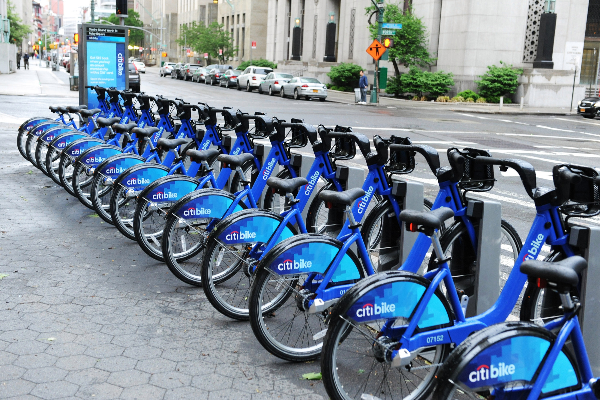

This project is focusing on utilizing Tableau on the large datasets provided by Citi Bike. 

## Getting Started

Tableau public is required on your local machine. 
Datasets can be found at https://www.citibikenyc.com/system-data 

## Project Breakdown

### Clean up the data using Jupyter Notebook
#### Combined the two datasets together in order to utilize them functionally. 
* Load the two datasets onto the Jupyter Notebook 
* combine the two datasets 
* change the column name to match one another. 
* Export the dataset as a csv file. 

## Data and Visualization Exploration

#### The busiest day for Citi Bike

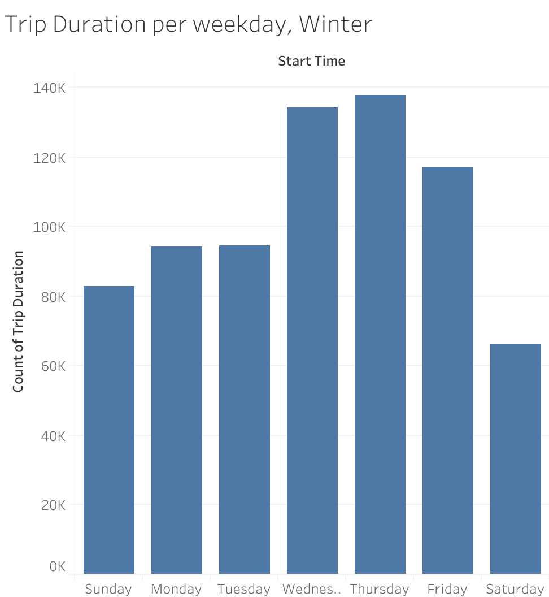
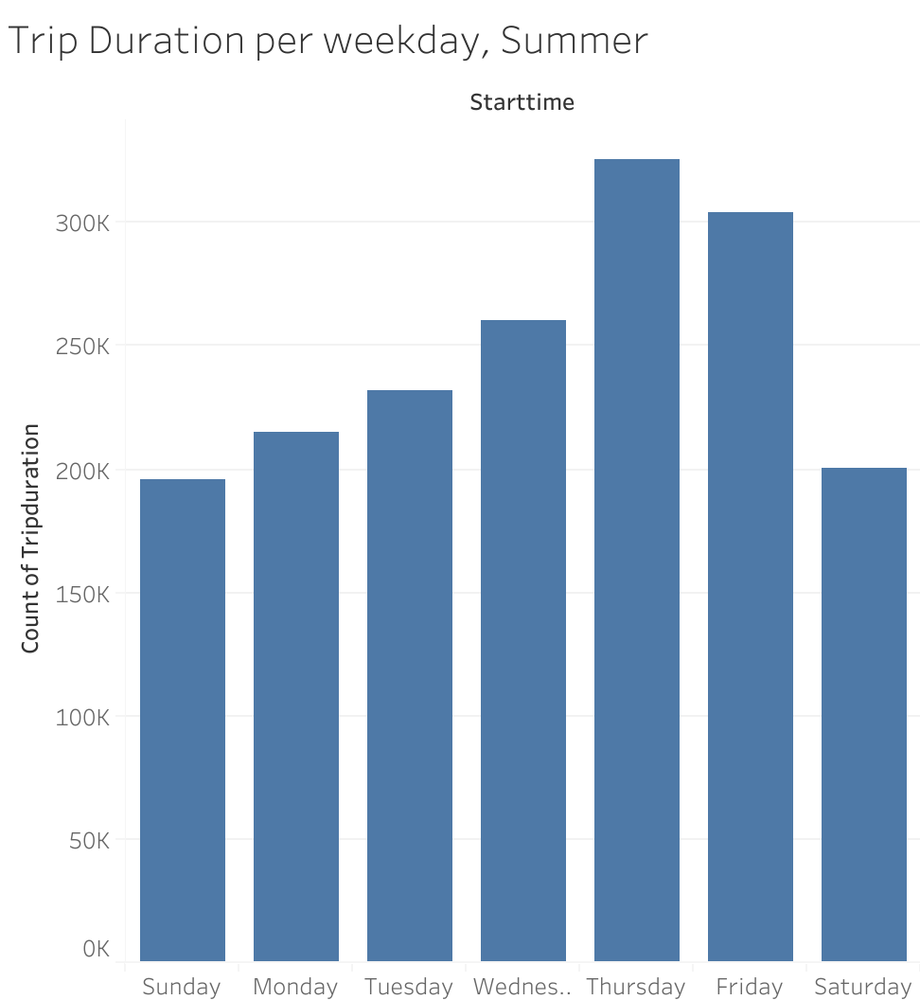

During winter, the majority of bike riders use the Citi Bike on Wednesdays and Thursday. However, Thursdays and Fridays are the most popular days during Summer. Looking at the amount of Bike users during two seasons, as predicted, Summer is the more popular season for Citi Bike users. 

#### Peak hours for Citi Bike

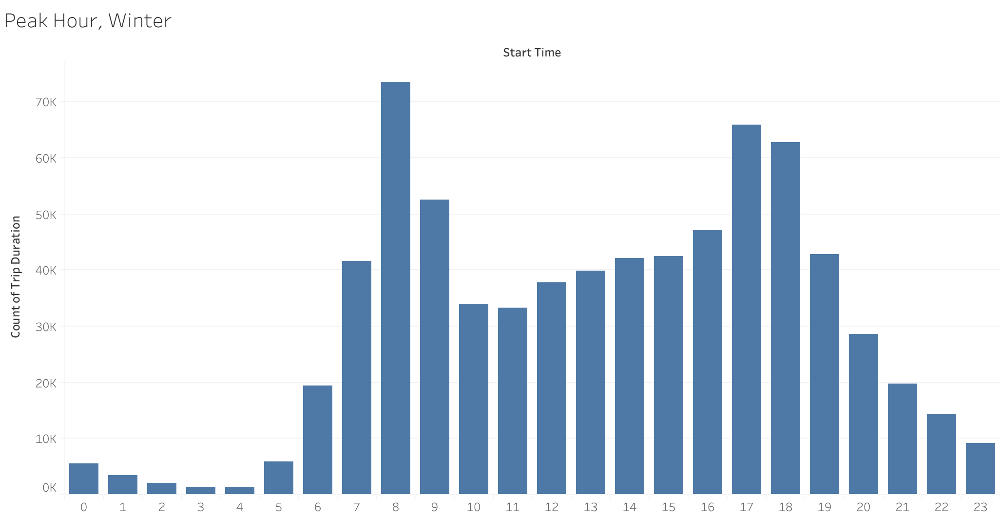
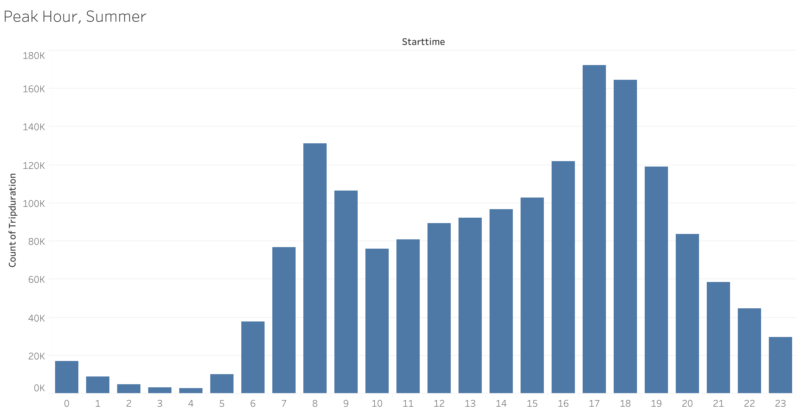

As predicted for both summer and winter, the peak hours of Citi Bike is during the rush hours where subscribers are going to and from their offices. With the rate of summer is 3x higher than winter. 

#### Top stations for Citi Bike

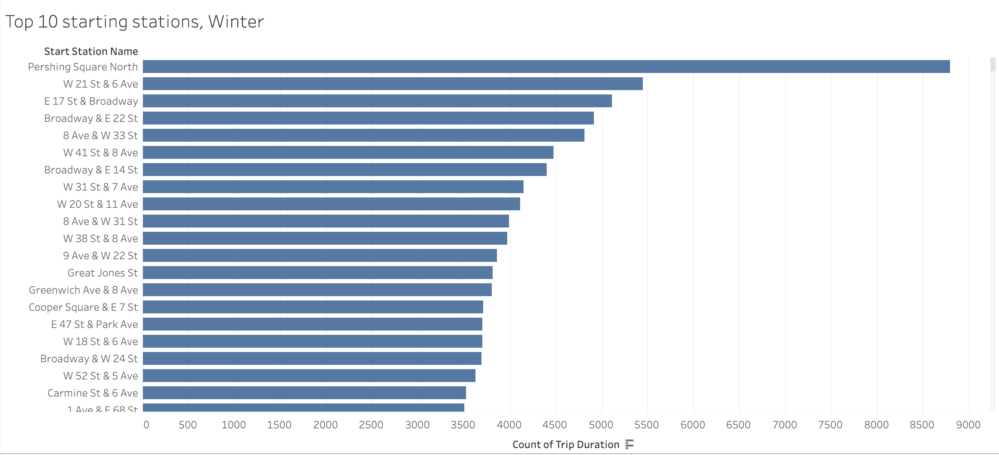
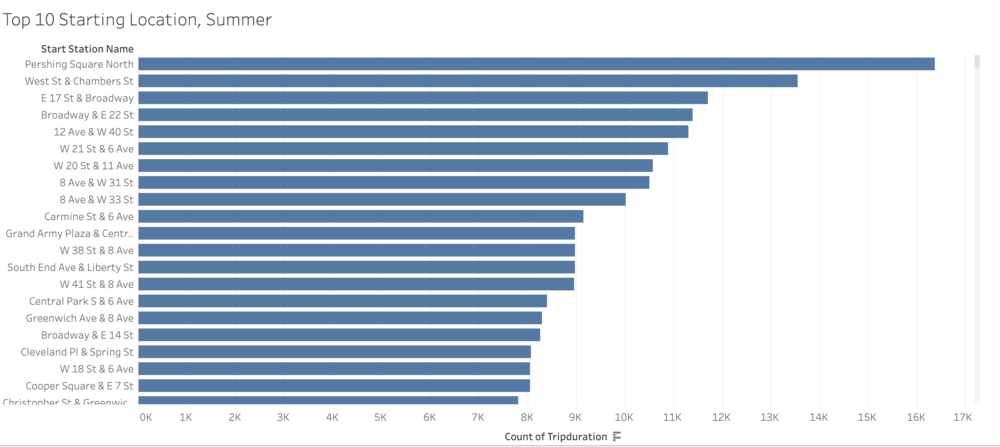

Pershing Square North is the most busiest station for both summer and winter season. It locates in the heart of financial district of Manhattan where offices, restaurants, and important landmarks are located. 

#### User Categories for Citi Bike

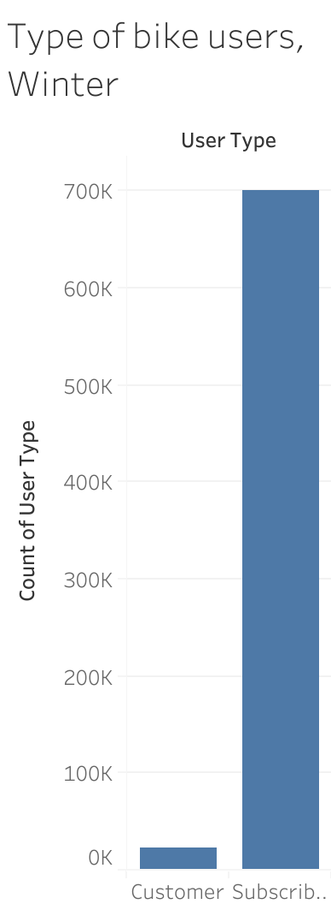
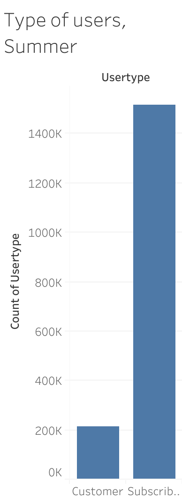

Subscribers are the dominant users for Citi Bike for both summer and winter. The number of both customers and subscribers increases during the summer compare to the winter season. 

#### Gender for Citi Bike

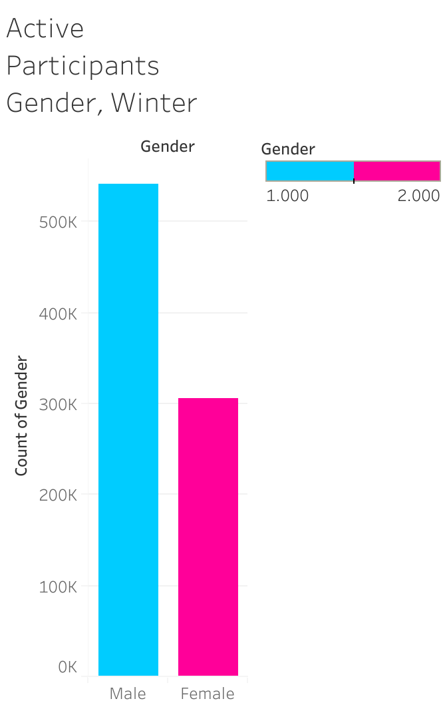
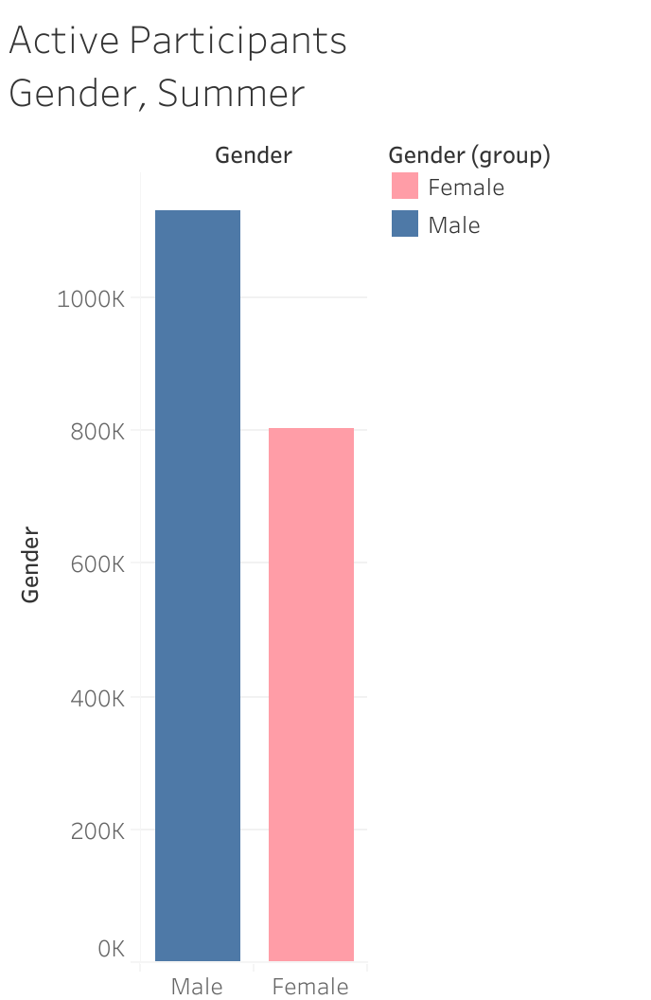

As anticipated, Male is the dominent gender for Citi Bike. However, the amount of female bikers increase sharply for summer in compare to winter season. 

## Obstacles
* The only limiting factor for this project is the time. Data from other city bike company should be obtained in order to compare them closely. 
* Certain data is too ambiguous. For instance, participants with the age of 130 years old has riden the bike. 
* The files were too large to save on the public Tableau, so I have to seperate the two datasets and work on them seperately. 
* All of the files were to large to upload onto the GitHub. 

Here's link to the Tableau projects: 

Winter Data: https://public.tableau.com/shared/WSRD7N5XG?:display_count=yes

Summer Data: https://public.tableau.com/shared/7S8SWZWTK?:display_count=yes 
